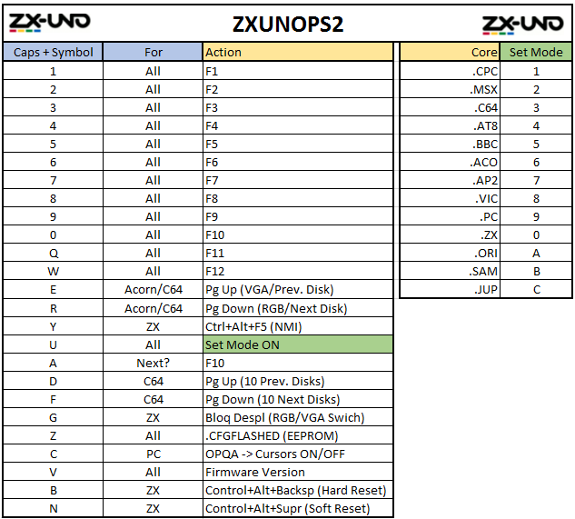

Modificacion a partir del código de Neuro (enlace indicado en el archivo de licencia).

Entre otros cambios, este fork sale de la línea de envío de scancodes especiales de forma reiterada, mediante pulsacion de shift o symbol. 

En su lugar se envían los scancodes una sola vez y se vuelven a enviar la liberación de los mismos una vez soltada la tecla.

Release 2

-> Compatibilidad con teclados +2A/+3. (Atmega 644)

-> OPQA mapeado en cursores para el modo PC.

